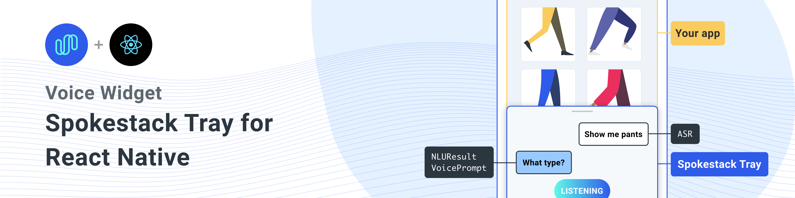
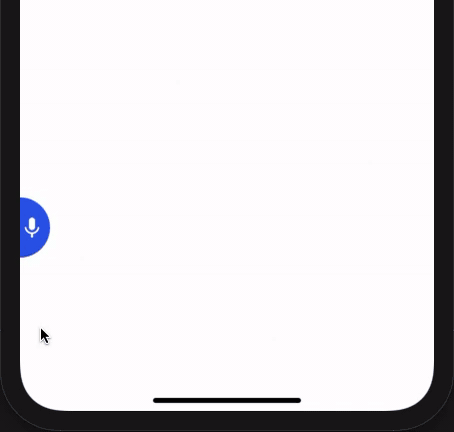

<a href="https://www.spokestack.io/blog/integrating-spokestack-in-react-native" title="Integrating Spokestack in React Native"></a>

A React Native component for adding Spokestack to any React Native app.



## Installation

Install this library with the peer dependencies

A one-liner to install all dependencies

```sh
npm install react-native-spokestack-tray react-native-spokestack @react-native-community/async-storage react-native-video react-native-haptic-feedback react-native-linear-gradient react-native-permissions
```

### Each dependency by its usage.

```sh
$ npm install react-native-spokestack-tray react-native-spokestack

# Used for storing a simple boolean to turn on/off sound
$ npm install @react-native-community/async-storage

# Used to play TTS audio prompts.
# Despite its name, we think this is one of the best
# plugins (if not the best) for playing audio.
# In iOS, Audio and Video are intertwined anyway.
$ npm install react-native-video

# Used to show an animating gradient when Spokestack listens
$ npm install react-native-linear-gradient

# Used to check microphone and speech recognition permissions
$ npm install react-native-permissions

# Used to generate a haptic whenever Spokestack listens.
# This can be turned off, but the dependency is still needed.
$ npm install react-native-haptic-feedback
```

Then follow the instructions for each platform to link react-native-spokestack to your project:

## iOS installation

<details>
  <summary>iOS details</summary>

### Edit Podfile

Before running `pod install`, make sure to make the following edits.

react-native-spokestack makes use of relatively new APIs only available in iOS 13+. Make sure to set your deployment target to iOS 13 at the top of your Podfile:

Also set your deployment target to 13.0 in your XCode project.

```ruby
platform :ios, '13.0'
```

We use [react-native-permissions](https://github.com/react-native-community/react-native-permissions) to check and request the Microphone permission (iOS and Android) and the Speech Recognition permission (iOS only). This library separates each permission into its own pod to avoid inflating your app with code you don't use. Add the following pods to your Podfile:

```ruby
target 'SpokestackTrayExample' do
  # ...
  permissions_path = '../node_modules/react-native-permissions/ios'
  pod 'Permission-Microphone', :path => "#{permissions_path}/Microphone.podspec"
  pod 'Permission-SpeechRecognition', :path => "#{permissions_path}/SpeechRecognition.podspec"
```

We also need to use `use_frameworks!` in our Podfile in order to support dependencies written in Swift.

```ruby
target 'SpokestackExample' do
  use_frameworks!
  #...
```

For the time being, `use_frameworks!` does not work with Flipper, so we also need to disable Flipper. Remove any Flipper-related lines in your Podfile. In React Native 0.63.2, they look like this:

```ruby
  # X Remove or comment out these lines X
  use_flipper!
  post_install do |installer|
    flipper_post_install(installer)
  end
  # XX
```

Remove your existing Podfile.lock and Pods folder to ensure no conflicts, then install the pods:

```sh
$ npx pod-install
```

### Edit Info.plist

Add the following to your Info.plist to enable permissions. In XCode, also ensure your iOS deployment target is set to 13.0 or higher.

```xml
<key>NSMicrophoneUsageDescription</key>
<string>This app uses the microphone to hear voice commands</string>
<key>NSSpeechRecognitionUsageDescription</key>
<string>This app uses speech recognition to process voice commands</string>
```

#### Remove Flipper

While Flipper works on fixing their pod for `use_frameworks!`, we must disable Flipper. We already removed the Flipper dependencies from Pods above, but there remains some code in the AppDelegate.m that imports Flipper. There are two ways to fix this.

1. You can disable Flipper imports without removing any code from the AppDelegate. To do this, open your xcworkspace file in XCode. Go to your target, then Build Settings, search for "C Flags", remove `-DFB_SONARKIT_ENABLED=1` from flags.
1. Remove all Flipper-related code from your AppDelegate.m.

In our example app, we've done option 1 and left in the Flipper code in case they get it working in the future and we can add it back.

### Edit AppDelegate.m

#### Add AVFoundation to imports

```objc
#import <AVFoundation/AVFoundation.h>
```

#### AudioSession category

Set the AudioSession category. There are several configurations that work.

The following is a suggestion that should fit most use cases:

```objc
- (BOOL)application:(UIApplication *)application didFinishLaunchingWithOptions:(NSDictionary *)launchOptions
{
  AVAudioSession *session = [AVAudioSession sharedInstance];
  [session setCategory:AVAudioSessionCategoryPlayAndRecord
     mode:AVAudioSessionModeDefault
  options:AVAudioSessionCategoryOptionDefaultToSpeaker | AVAudioSessionCategoryOptionAllowAirPlay | AVAudioSessionCategoryOptionAllowBluetoothA2DP | AVAudioSessionCategoryOptionAllowBluetooth
    error:nil];
  [session setActive:YES error:nil];

  // ...
```

</details>

## Android installation

<details>
  <summary>Android details</summary>

### ASR Support

The example usage uses the system-provided ASRs (`AndroidSpeechRecognizer` and `AppleSpeechRecognizer`). However, `AndroidSpeechRecognizer` is not available on 100% of devices. If your app supports a device that doesn't have built-in speech recognition, use Spokestack ASR instead by setting the `profile` to a Spokestack profile using the `profile` prop.

See our [ASR documentation](https://www.spokestack.io/docs/concepts/asr) for more information.

### Edit root build.gradle (_not_ app/build.gradle)

```groovy
// ...
  ext {
    // Minimum SDK is 21
    minSdkVersion = 21
// ...
  dependencies {
    // Minimium gradle is 3.0.1+
    // The latest React Native already has this
    classpath("com.android.tools.build:gradle:3.5.3")
```

### Edit AndroidManifest.xml

Add the necessary permissions to your `AndroidManifest.xml`. The first permission is often there already. The second is needed for using the microphone.

```xml
    <!-- For TTS -->
    <uses-permission android:name="android.permission.INTERNET" />
    <!-- For wakeword and ASR -->
    <uses-permission android:name="android.permission.RECORD_AUDIO" />
    <!-- For ensuring no downloads happen over cellular, unless forced -->
    <uses-permission android:name="android.permission.ACCESS_NETWORK_STATE" />
```

</details>

## Usage

```js
import SpokestackTray, { listen } from 'react-native-spokestack-tray'

// ...

export default function ConversationHandler({ navigation }) {
  return (
    <SpokestackTray
      clientId={process.env.SPOKESTACK_CLIENT_ID}
      clientSecret={process.env.SPOKESTACK_CLIENT_SECRET}
      handleIntent={(intent, slots, utterance) => {
        switch (intent) {
          // These cases would be for all
          // the possible intents defined in your NLU.
          case 'request.select':
            // As an example, search with some service
            // with the given value from the NLU
            const recipe = SearchService.find(slots.recipe?.value)
            // An example of navigating to some scene to show
            // data, a recipe in our example.
            navigation.navigate('Recipe', { recipe })
            return {
              node: 'info.recipe',
              prompt: 'We found your recipe!'
            }
          default:
            return {
              node: 'welcome',
              prompt: 'Let us help you find a recipe.'
            }
        }
      }}
      // The NLU models are downloaded and then cached
      // when the app is first installed.
      // See https://spokestack.io/docs/concepts/nlu
      // for more info on NLU.
      nlu={{
        nlu: 'https://somecdn/nlu.tflite',
        vocab: 'https://somecdn/vocab.txt',
        metadata: 'https://somecdn/metadata.json'
      }}
    />
  )
}
```

## Including model files in your app bundle

To include model files locally in your app (rather than downloading them from a CDN), you also need to add the necessary extensions so
the files can be included by Babel. To do this, edit your [`metro.config.js`](https://facebook.github.io/metro/docs/configuration/).

```js
const defaults = require('metro-config/src/defaults/defaults')

module.exports = {
  resolver: {
    // json is already in the list
    assetExts: defaults.assetExts.concat(['tflite', 'txt', 'sjson'])
  }
}
```

Then include model files using source objects:

```js
<SpokestackTray
  clientId={process.env.SPOKESTACK_CLIENT_ID}
  clientSecret={process.env.SPOKESTACK_CLIENT_SECRET}
  handleIntent={handleIntent}
  wakeword={{
    filter: require('./filter.tflite'),
    detect: require('./detect.tflite'),
    encode: require('./encode.tflite')
  }}
  nlu={{
    model: require('./nlu.tflite'),
    vocab: require('./vocab.txt'),
    // Be sure not to use "json" here.
    // We use a different extension (.sjson) so that the file is not
    // immediately parsed as json and instead
    // passes a require source object to Spokestack.
    // The special extension is only necessary for local files.
    metadata: require('./metadata.sjson')
  }}
/>
```

This is not required. Pass remote URLs to the same config options and the files will be downloaded and cached when first calling `initialize`.

## Contributing

See the [contributing guide](CONTRIBUTING.md) to learn how to contribute to the repository and the development workflow.

---

# Documentation

## `<SpokestackTray />` Component Props

### buttonWidth

• `Optional` **buttonWidth**: number (Default: **60**)

_Defined in [src/SpokestackTray.tsx:129](https://github.com/spokestack/react-native-spokestack-tray/blob/d603623/src/SpokestackTray.tsx#L129)_

Width (and height) of the mic button

### clientId

• **clientId**: string

_Defined in [src/SpokestackTray.tsx:74](https://github.com/spokestack/react-native-spokestack-tray/blob/d603623/src/SpokestackTray.tsx#L74)_

Your Spokestack tokens generated in your Spokestack account
at https://spokestack.io/account.
Create an account for free then generate a token.
This is from the "ID" field.

### clientSecret

• **clientSecret**: string

_Defined in [src/SpokestackTray.tsx:81](https://github.com/spokestack/react-native-spokestack-tray/blob/d603623/src/SpokestackTray.tsx#L81)_

Your Spokestack tokens generated in your Spokestack account
at https://spokestack.io/account.
Create an account for free then generate a token.
This is from the "secret" field.

### closeDelay

• `Optional` **closeDelay**: number (Default: **0**)

_Defined in [src/SpokestackTray.tsx:131](https://github.com/spokestack/react-native-spokestack-tray/blob/d603623/src/SpokestackTray.tsx#L131)_

How long to wait to close the tray after speaking (ms)

### debug

• `Optional` **debug**: boolean

_Defined in [src/SpokestackTray.tsx:133](https://github.com/spokestack/react-native-spokestack-tray/blob/d603623/src/SpokestackTray.tsx#L133)_

Show debug messages from react-native-spokestack

### duration

• `Optional` **duration**: number (Default: **500**)

_Defined in [src/SpokestackTray.tsx:135](https://github.com/spokestack/react-native-spokestack-tray/blob/d603623/src/SpokestackTray.tsx#L135)_

Duration for the tray animation (ms)

### easing

• `Optional` **easing**: EasingFunction (Default: **Easing.bezier(0.77, 0.41, 0.2, 0.84)**)

_Defined in [src/SpokestackTray.tsx:137](https://github.com/spokestack/react-native-spokestack-tray/blob/d603623/src/SpokestackTray.tsx#L137)_

Easing function for the tray animation

### editTranscript

• `Optional` **editTranscript**: (transcript: string) => string (Default: **(transcript: string) => string**)

_Defined in [src/SpokestackTray.tsx:142](https://github.com/spokestack/react-native-spokestack-tray/blob/d603623/src/SpokestackTray.tsx#L142)_

Edit the transcript before classification
and before the user response bubble is shown.

### exitNodes

• `Optional` **exitNodes**: string[]

_Defined in [src/SpokestackTray.tsx:147](https://github.com/spokestack/react-native-spokestack-tray/blob/d603623/src/SpokestackTray.tsx#L147)_

All nodes in this array should end
the conversation and close the tray

### fontFamily

• `Optional` **fontFamily**: string

_Defined in [src/SpokestackTray.tsx:152](https://github.com/spokestack/react-native-spokestack-tray/blob/d603623/src/SpokestackTray.tsx#L152)_

Font to use for "LISTENING...", "LOADING...",
and chat bubble text.

### gradientColors

• `Optional` **gradientColors**: string[] (Default: **['#61fae9', '#2F5BEA']**)

_Defined in [src/SpokestackTray.tsx:157](https://github.com/spokestack/react-native-spokestack-tray/blob/d603623/src/SpokestackTray.tsx#L157)_

Colors for the linear gradient shown when listening
Can be any number of colors (recommended: 2-3)

### greet

• `Optional` **greet**: boolean (Default: **false**)

_Defined in [src/SpokestackTray.tsx:163](https://github.com/spokestack/react-native-spokestack-tray/blob/d603623/src/SpokestackTray.tsx#L163)_

Whether to greet the user with a welcome message
when the tray opens.
Note: `handleIntent` must respond to the "greet" intent.

### handleIntent

• **handleIntent**: (intent: string, slots?: SpokestackNLUResult[\"slots\"], utterance?: string) => [IntentResult](#IntentResult)

_Defined in [src/SpokestackTray.tsx:91](https://github.com/spokestack/react-native-spokestack-tray/blob/d603623/src/SpokestackTray.tsx#L91)_

This function takes an intent from the NLU
and returns an object with a unique conversation
node name (that you define) and a prompt
to be processed by TTS and spoken.

Note: the prompt is only shown in a chat bubble
if sound has been turned off.

### haptic

• `Optional` **haptic**: boolean (Default: **true**)

_Defined in [src/SpokestackTray.tsx:168](https://github.com/spokestack/react-native-spokestack-tray/blob/d603623/src/SpokestackTray.tsx#L168)_

Set this to false to disable the haptic
that gets played whenever the tray starts listening.

### minHeight

• `Optional` **minHeight**: number (Default: **170**)

_Defined in [src/SpokestackTray.tsx:170](https://github.com/spokestack/react-native-spokestack-tray/blob/d603623/src/SpokestackTray.tsx#L170)_

Minimum height for the tray

### nlu

• **nlu**: SpokestackConfig[\"nlu\"]

_Defined in [src/SpokestackTray.tsx:127](https://github.com/spokestack/react-native-spokestack-tray/blob/d603623/src/SpokestackTray.tsx#L127)_

The NLU Tensorflow Lite model (.tflite), JSON metadata, and NLU vocabulary (.txt)

All 3 fields accept 2 types of values.

1. A string representing a remote URL from which to download and cache the file (presumably from a CDN).
2. A source object retrieved by a `require` or `import` (e.g. `model: require('./nlu.tflite')`)

See https://spokestack.io/docs/concepts/nlu to learn more about NLU.

```js
// ...
nlu={{
  model: 'https://somecdn.com/nlu.tflite',
  metadata: 'https://somecdn.com/metadata.json',
  vocab: 'https://somecdn.com/vocab.txt'
}}
```

You can also pass local files.
Note: this requires a change to your metro.config.js. For more info, see
"Including model files in your app bundle" in the README.md.

```js
// ...
nlu={{
  model: require('./nlu.tflite'),
  metadata: require('./metadata.json'),
  vocab: require('./vocab.txt')
}}
```

### onClose

• `Optional` **onClose**: () => void

_Defined in [src/SpokestackTray.tsx:174](https://github.com/spokestack/react-native-spokestack-tray/blob/d603623/src/SpokestackTray.tsx#L174)_

Called whenever the tray has closed

### onError

• `Optional` **onError**: (e: SpokestackErrorEvent) => void

_Defined in [src/SpokestackTray.tsx:176](https://github.com/spokestack/react-native-spokestack-tray/blob/d603623/src/SpokestackTray.tsx#L176)_

Called whenever there's an error from Spokestack

### onOpen

• `Optional` **onOpen**: () => void

_Defined in [src/SpokestackTray.tsx:178](https://github.com/spokestack/react-native-spokestack-tray/blob/d603623/src/SpokestackTray.tsx#L178)_

Called whenever the tray has opened

### orientation

• `Optional` **orientation**: \"left\" \| \"right\" (Default: **"left"**)

_Defined in [src/SpokestackTray.tsx:182](https://github.com/spokestack/react-native-spokestack-tray/blob/d603623/src/SpokestackTray.tsx#L182)_

The tray button can be oriented on either side of the screen

### primaryColor

• `Optional` **primaryColor**: string (Default: **"#2f5bea"**)

_Defined in [src/SpokestackTray.tsx:187](https://github.com/spokestack/react-native-spokestack-tray/blob/d603623/src/SpokestackTray.tsx#L187)_

This color is used to theme the tray
and is used in the mic button and speech bubbles.

### profile

• `Optional` **profile**: PipelineProfile

_Defined in [src/SpokestackTray.tsx:208](https://github.com/spokestack/react-native-spokestack-tray/blob/d603623/src/SpokestackTray.tsx#L208)_

The Spokestack config profile to pass to
react-native-spokestack.
These are available from react-native-spokestack
starting in version 4.0.0.

If Wakeword config files are specified, the default will be
`TFLITE_WAKEWORD_NATIVE_ASR`.
Otherwise, the default is `PTT_NATIVE_ASR`.

```js
import SpokestackTray from 'react-native-spokestack-tray'
import { PipelineProfile } from 'react-native-spokestack'

// ...
<SpokestackTray
 profile={PipelineProfile.TFLITE_WAKEWORD_SPOKESTACK_ASR}
// ...
```

### refreshModels

• `Optional` **refreshModels**: boolean

_Defined in [src/SpokestackTray.tsx:215](https://github.com/spokestack/react-native-spokestack-tray/blob/d603623/src/SpokestackTray.tsx#L215)_

Use this sparingly to refresh the
wakeword and NLU models on device
(force overwrite).
`<SpokestackTray refreshModels={process.env.NODE_ENV !== 'production'} ... />`

### sayGreeting

• `Optional` **sayGreeting**: boolean (Default: **true**)

_Defined in [src/SpokestackTray.tsx:221](https://github.com/spokestack/react-native-spokestack-tray/blob/d603623/src/SpokestackTray.tsx#L221)_

Whether to speak the greeting or only display
a chat bubble with the greet message,
even if sound is on.

### soundOffImage

• `Optional` **soundOffImage**: React.ReactNode (Default: **( <Image source={soundOffImage} style={{ width: 30, height: 30 }} /\> )**)

_Defined in [src/SpokestackTray.tsx:225](https://github.com/spokestack/react-native-spokestack-tray/blob/d603623/src/SpokestackTray.tsx#L225)_

Replace the sound off image by passing an <Image />

### soundOnImage

• `Optional` **soundOnImage**: React.ReactNode (Default: **( <Image source={soundOnImage} style={{ width: 30, height: 30 }} /\> )**)

_Defined in [src/SpokestackTray.tsx:223](https://github.com/spokestack/react-native-spokestack-tray/blob/d603623/src/SpokestackTray.tsx#L223)_

Replace the sound on image by passing an <Image />

### spokestackConfig

• `Optional` **spokestackConfig**: Partial<SpokestackConfig\>

_Defined in [src/SpokestackTray.tsx:232](https://github.com/spokestack/react-native-spokestack-tray/blob/d603623/src/SpokestackTray.tsx#L232)_

Pass options directly to the Spokestack.initialize()
function from react-native-spokestack.
See https://github.com/spokestack/react-native-spokestack
for available options.

### startHeight

• `Optional` **startHeight**: number (Default: **220**)

_Defined in [src/SpokestackTray.tsx:234](https://github.com/spokestack/react-native-spokestack-tray/blob/d603623/src/SpokestackTray.tsx#L234)_

Starting height for tray

### style

• `Optional` **style**: Animated.WithAnimatedValue<StyleProp<ViewStyle\>\>

_Defined in [src/SpokestackTray.tsx:236](https://github.com/spokestack/react-native-spokestack-tray/blob/d603623/src/SpokestackTray.tsx#L236)_

This style prop is passed to the tray's container

### ttsFormat

• `Optional` **ttsFormat**: TTSFormat (Default: **TTSFormat.TEXT**)

_Defined in [src/SpokestackTray.tsx:238](https://github.com/spokestack/react-native-spokestack-tray/blob/d603623/src/SpokestackTray.tsx#L238)_

The format for the text passed to Spokestack.synthesize

### voice

• `Optional` **voice**: string (Default: **"demo-male"**)

_Defined in [src/SpokestackTray.tsx:240](https://github.com/spokestack/react-native-spokestack-tray/blob/d603623/src/SpokestackTray.tsx#L240)_

A key for a voice in Spokestack ASR, passed to Spokestack.synthesize

### wakeword

• `Optional` **wakeword**: SpokestackConfig[\"wakeword\"]

_Defined in [src/SpokestackTray.tsx:274](https://github.com/spokestack/react-native-spokestack-tray/blob/d603623/src/SpokestackTray.tsx#L274)_

The NLU Tensorflow Lite models (.tflite) for wakeword.

All 3 fields accept 2 types of values.

1. A string representing a remote URL from which to download and cache the file (presumably from a CDN).
2. A source object retrieved by a `require` or `import` (e.g. `model: require('./nlu.tflite')`)

See https://spokestack.io/docs/concepts/wakeword-models to learn more about Wakeword

Spokestack offers sample wakeword model files ("Spokestack"):

```js
// ...
wakeword={{
  filter: 'https://d3dmqd7cy685il.cloudfront.net/model/wake/spokestack/filter.tflite',
  detect: 'https://d3dmqd7cy685il.cloudfront.net/model/wake/spokestack/detect.tflite',
  encode: 'https://d3dmqd7cy685il.cloudfront.net/model/wake/spokestack/encode.tflite'
}}
```

You can also download these models ahead of time and include them from local files.
Note: this requires a change to your metro.config.js. For more info, see
"Including model files in your app bundle" in the README.md.

```js
// ...
wakeword={{
  filter: require('./filter.tflite'),
  detect: require('./detect.tflite'),
  encode: require('./encode.tflite')
}}
```

---

#### `IntentResult`

IntentResult is the expected return type of `handleIntent`.

`Optional` **data**: any

`Optional` **noInterrupt**: boolean

**node**: string

**prompt**: string

---

## `<SpokestackTray />` Component Methods

These methods are available from the SpokestackTray component. Use a React ref to access these methods.

```js
const spokestackTray = useRef(null)

  // ...
  <SpokestackTray ref={spokestackTray}

// ...
spokestackTray.current.say('Here is something for Spokestack to say')
```

**Note**: In most cases, you should call `listen` instead of `open`.

---

### open

▸ **open**(): void

_Defined in [src/SpokestackTray.tsx:641](https://github.com/spokestack/react-native-spokestack-tray/blob/d603623/src/SpokestackTray.tsx#L641)_

Open the tray, greet (if applicable), and listen

**Returns:** void

---

### close

▸ **close**(): void

_Defined in [src/SpokestackTray.tsx:652](https://github.com/spokestack/react-native-spokestack-tray/blob/d603623/src/SpokestackTray.tsx#L652)_

Close the tray, stop listening, and restart wakeword

**Returns:** void

---

### say

▸ **say**(`input`: string): Promise<void\>

_Defined in [src/SpokestackTray.tsx:664](https://github.com/spokestack/react-native-spokestack-tray/blob/d603623/src/SpokestackTray.tsx#L664)_

Passes the input to Spokestack.synthesize(),
plays the audio, and adds a speech bubble.

---

### addBubble

▸ **addBubble**(`bubble`: Bubble): void

_Defined in [src/SpokestackTray.tsx:698](https://github.com/spokestack/react-native-spokestack-tray/blob/d603623/src/SpokestackTray.tsx#L698)_

Add a bubble (system or user)
to the chat interface

#### `Bubble`

**isLeft**: boolean

**text**: string

---

### toggleSilent

▸ **toggleSilent**(): Promise<boolean\>

_Defined in [src/SpokestackTray.tsx:715](https://github.com/spokestack/react-native-spokestack-tray/blob/d603623/src/SpokestackTray.tsx#L715)_

Toggle silent mode

**Returns:** Promise<boolean\>

---

### isSilent

▸ **isSilent**(): boolean

_Defined in [src/SpokestackTray.tsx:727](https://github.com/spokestack/react-native-spokestack-tray/blob/d603623/src/SpokestackTray.tsx#L727)_

Returns whether the tray is in silent mode

**Returns:** boolean

---

## Spokestack Functions

These functions are available as exports from react-native-spokestack-tray

---

### listen

▸ **listen**(): Promise<boolean\>

_Defined in [src/Spokestack.ts:5](https://github.com/spokestack/react-native-spokestack-tray/blob/d603623/src/Spokestack.ts#L5)_

**Returns:** Promise<boolean\>

---

### isListening

• `Const` **isListening**: isActivated = Spokestack.isActivated

_Defined in [src/index.ts:16](https://github.com/spokestack/react-native-spokestack-tray/blob/d603623/src/index.ts#L16)_

Returns whether Spokestack is currently listening

```js
console.log(`isListening: ${await isListening()}`)
```

---

### isInitialized

• `Const` **isInitialized**: isInitialized = Spokestack.isInitialized

_Defined in [src/index.ts:24](https://github.com/spokestack/react-native-spokestack-tray/blob/d603623/src/index.ts#L24)_

Returns whether Spokestack has been initialized

```js
console.log(`isInitialized: ${await isInitialized()}`)
```

---

### isStarted

• `Const` **isStarted**: isStarted = Spokestack.isStarted

_Defined in [src/index.ts:32](https://github.com/spokestack/react-native-spokestack-tray/blob/d603623/src/index.ts#L32)_

Returns whether the speech pipeline has been started

```js
console.log(`isStarted: ${await isStarted()}`)
```

---

### addEventListener

• `Const` **addEventListener**: addListener = Spokestack.addEventListener

_Defined in [src/index.ts:48](https://github.com/spokestack/react-native-spokestack-tray/blob/d603623/src/index.ts#L48)_

Bind to any event emitted by the native libraries
The events are: "recognize", "partial_recognize", "error", "activate", "deactivate", and "timeout".
See the bottom of the README.md for descriptions of the events.

```js
useEffect(() => {
  const listener = addEventListener('recognize', onRecognize)
  // Unsubscribe by calling remove when components are unmounted
  return () => {
    listener.remove()
  }
}, [])
```

---

### removeAllListeners

• `Const` **removeAllListeners**: () => void = Spokestack.removeAllListeners

_Defined in [src/index.ts:66](https://github.com/spokestack/react-native-spokestack-tray/blob/d603623/src/index.ts#L66)_

Remove any existing listeners

```js
componentWillUnmount() {
  removeAllListeners()
}
```

---

# Events

Use `addEventListener()`, `removeEventListener()`, and `removeAllListeners()` to add and remove events handlers. All events are available in both iOS and Android.

| Name              |           Data           |                                                                   Description |
| :---------------- | :----------------------: | ----------------------------------------------------------------------------: |
| recognize         | `{ transcript: string }` |                     Fired whenever speech recognition completes successfully. |
| partial_recognize | `{ transcript: string }` |              Fired whenever the transcript changes during speech recognition. |
| timeout           |          `null`          |           Fired when an active pipeline times out due to lack of recognition. |
| activate          |          `null`          | Fired when the speech pipeline activates, either through the VAD or manually. |
| deactivate        |          `null`          |                                   Fired when the speech pipeline deactivates. |
| play              |  `{ playing: boolean }`  |         Fired when TTS playback starts and stops. See the `speak()` function. |
| error             |   `{ error: string }`    |                                    Fired when there's an error in Spokestack. |

_When an error event is triggered, any existing promises are rejected as it's difficult to know exactly from where the error originated and whether it may affect other requests._

---

## Checking speech permissions

These utility functions are used by Spokestack to check microphone permission on iOS and Android and speech recognition permission on iOS.

---

### checkSpeech

▸ **checkSpeech**(): Promise<boolean\>

_Defined in [src/utils/permissions.ts:78](https://github.com/spokestack/react-native-spokestack-tray/blob/d603623/src/utils/permissions.ts#L78)_

This function can be used to check whether the user has given
the necessary permission for speech.
On iOS, this includes both microphone and speech recnogition.
On Android, only the microphone is needed.

```js
import { checkSpeech } from 'react-native-spokestack-tray'

// ...

const hasPermission = await checkSpeech()
```

**Returns:** Promise<boolean\>

---

### requestSpeech

▸ **requestSpeech**(): Promise<boolean\>

_Defined in [src/utils/permissions.ts:106](https://github.com/spokestack/react-native-spokestack-tray/blob/d603623/src/utils/permissions.ts#L106)_

This function can be used to actually request
the necessary permission for speech.
On iOS, this includes both microphone and speech recnogition.
On Android, only the microphone is needed.

Note: if the user has declined in the past on iOS,
the user must be sent to Settings.

```js
import { requestSpeech } from 'react-native-spokestack-tray'

// ...

const hasPermission = await requestSpeech()
```

**Returns:** Promise<boolean\>

---

## License

MIT
